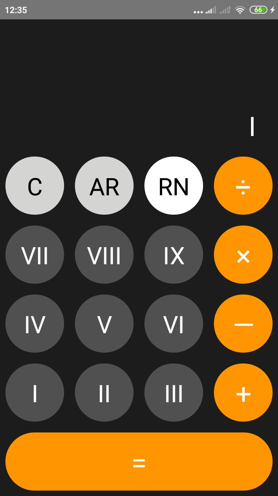
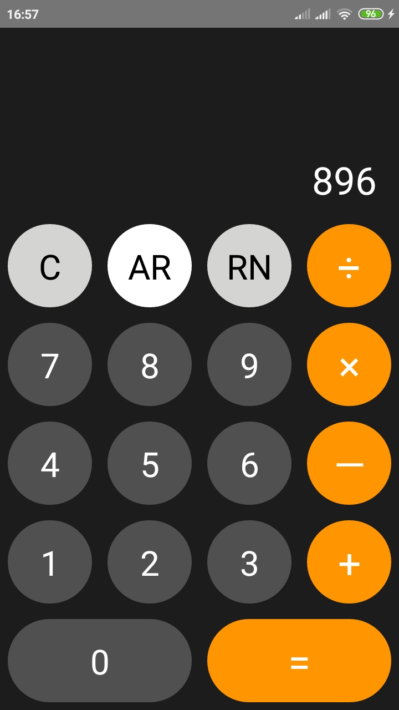
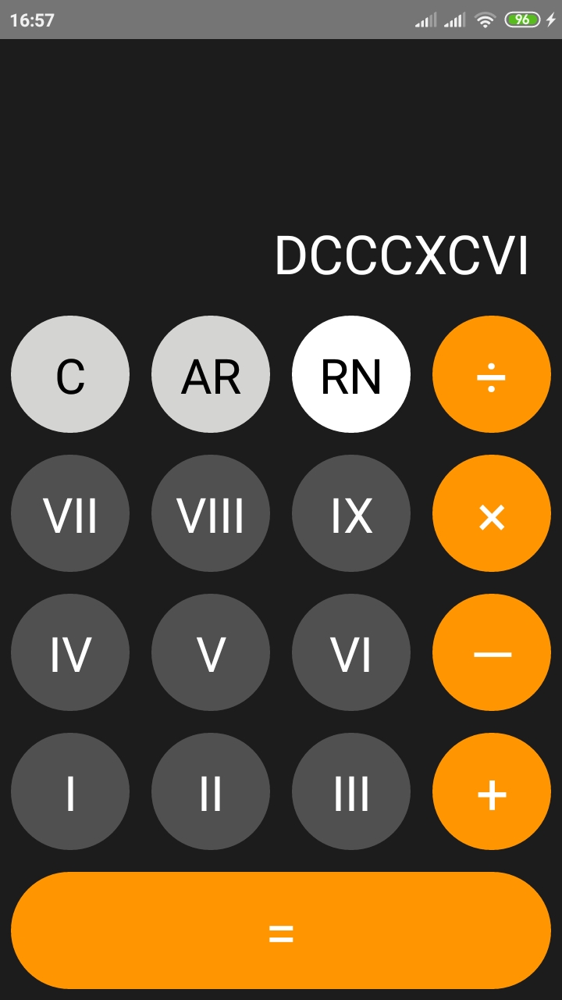

# Calculator
Calculator with basic arithmetic operations and conversion from Arabic to Roman Numeral and vice versa.

## Installation
1. If necessary, run `npm i -g create-react-native-app`
2. Go to the directory of the app and run `npm i` or `npm install`
3. Run an emulator on your local machine or connect a physical device. Make sure to allow to run prompt and developer option is enabled on your physical device.
4. Run `npx react-native run-android`

## Screenshots
### Initial screen:
Arabic (AR) button is pressed  |  Roman Numeral (RN) button is pressed
:-------------------------:|:-------------------------:
 | 

### Sample conversion:

AR button (Number: 896)    |  RN button (Number: 896)
:-------------------------:|:-------------------------:
  |  
